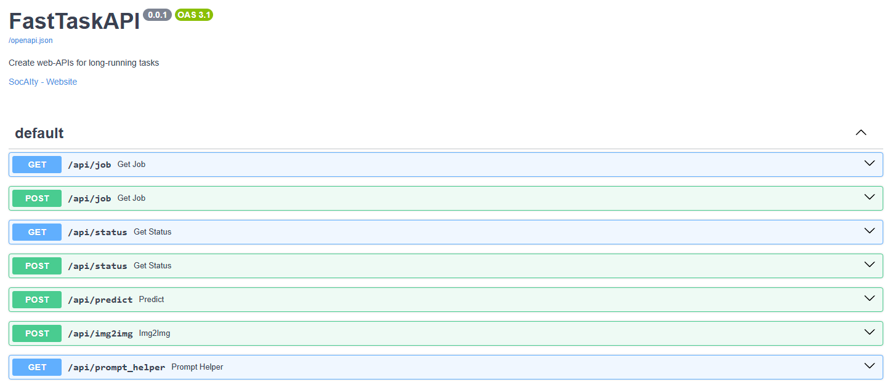

  <h1 align="center" style="margin-top:-25px">FastTaskAPI</h1>
  <h3 align="center" style="margin-top:-10px">Create web-APIs for long-running tasks</h3>
<p align="center">
  
</p>

<p align="center">
Call the server and return a job id. Get the result with the job id later.</br>
FastTaskAPI creates threaded jobs and job queues on the fly.</br>
Run services anywhere, be it local, hosted or serverless.</br>
</p>

<p align="center">
We at SocAIty developed FastTaskAPI to create and deploy our AI services as easy and standardized as possible.
Built on-top of FastAPI and runpod you can built high quality endpoints with proven stability. 
</p>

## Table of contents

Introduction
- [Why is this useful?](#why-is-this-useful): A section explaining why you should use this package.
- [What does this do?](#what-does-this-do): A section explaining the features of this package.

Get started:
- [Installation](#installation): A section explaining how to install the package.
- [First-steps](#how-to-use): Create your first service with the socaity router.
- [Jobs and job queues](#jobs-and-job-queues): A section explaining how to use the job queue functionality.
- [File uploads and files](#file-uploads-and-files): A section explaining how to use file uploads and files.
- [Backends and deploying a service](#backends-and-deploying-a-service): Deploy serverless for example with runpod.


## Why is this useful?
Creating services for long-running tasks is hard.
- In AI services inference time makes realtime results difficult. Parallel jobs, and a Job queue is often required. For example as a client you would not like to wait for a server response instead do some work until the server produced the result.
- Serverless deployments like runpod often DO NOT provide routing functionality. This router works in this conditions.
- Scaling AI services is hard.
- Streaming services (for example for generative models) is complicated to setup.
- Same Syntax for all kind of hosting providers and services.

This package solves these problems, by providing a simple well-known interface to deploy AI services anywhere.</br>
The syntax is oriented by the simplicity of fastapi. Other hazards are taken care of by our router.


## What does this do?


- Jobs, job queues for your service (no code required).
- Routing functionality: for serverless providers like [Runpod](Runpod.io)
- Async, sync and streaming functionality.
  - Including progress bars.
- File support, also for serverless providers like [Runpod](https://docs.runpod.io/serverless/workers/handlers/overview) 
  - Simplified sending files to the services with [fastSDK](https://github.com/SocAIty/fastSDK) 
  - One line file response with [MediaToolkit](https://github.com/SocAIty/media-toolkit) including images, audio, video and more.
- Integration: integrates neatly into the SOCAITY ecosystem for running AI services like python functions with our [Client](https://github.com/SocAIty/socaity-client)/[fastSDK](https://github.com/SocAIty/socaity).
- Monitoring server state.

The code is fast, lightweight, flexible and pure python.

## Installation 
You can install the package with PIP, or clone the repository.

```python
# install from pypi
pip install fast-task-api
# install from github for the newest version
pip install git+git://github.com/SocAIty/FastTaskAPI
```

# How to use
## Create your first service
Use the decorator syntax @app.task_endpoint to add an endpoint. This syntax is similar to [fastapi](https://fastapi.tiangolo.com/tutorial/first-steps/)'s @app.get syntax.

```python
from fast_task_api import FastTaskAPI, ImageFile

# define the app including your provider (fastapi, runpod..)
app = FastTaskAPI()

# add endpoints to your service
@app.task_endpoint("/predict")
def predict(my_param1: str, my_param2: int = 0):
  return f"my_awesome_prediction {my_param1} {my_param2}"

@app.task_endpoint("/img2img", queue_size=10)
def my_image_manipulator(upload_img: ImageFile):
  img_as_numpy = upload_img.to_np_array() 
  # Do some hard work here...
  # img_as_numpy = img2img(img_as_numpy)
  return ImageFile().from_np_array(img_as_numpy)

# start and run the server
app.start()
```
If you execute this code you should see the following page under http://localhost:8000/docs.


## Jobs and job queues

If you have a long running task, you can use the job queue functionality. 
```python
@app.task_endpoint(path="/make_fries", queue_size=100)
def make_fries(job_progress: JobProgress, fries_name: str, amount: int = 1):
    job_progress.set_status(0.1, f"started new fries creation {fries_name}")
    time.sleep(1)
    job_progress.set_status(0.5, f"I am working on it. Lots of work to do {amount}")
    time.sleep(2)
    job_progress.set_status(0.8, "Still working on it. Almost done")
    time.sleep(2)
    return f"Your fries {fries_name} are ready"
```
What will happen now is: 
- The method will return a "Job" object instead of the result, including a job id. This json is send back to the client.
- By calling the status endpoint with status?job_id=... one gets the result / status of the job.

Note: in case of "runpod", "serverless" this is not necessary, as the job mechanism is handled by runpod deployment.

### Calling the endpoints -> Getting the job result

You can call the endpoints with a simple http request.
You can try them out in the browser, with curl or Postman. 
For more convenience with the socaity package, you can use the endpoints like functions.

### Use the endpoints like functions with [fastSDK](https://github.com/SocAIty/fastSDK).
With fastSDK, you can use the endpoints like a function. FastSDK will deal with the job id and the status requests in the background.
This makes it insanely useful for complex scenarios where you use multiple models and endpoints.

### Job status and progress bars

You can provide status updates by changing the values of the job_progress object. 
If you add a parameter named job_progress to the function we will pass that object to the function.
If then a client asks for the status of the task, he will get the messages and the process bar. This is for example in the socaity package used to provide a progress bar.

```python
@app.task_endpoint("/predict", queue_size=10)
def predict(job_progress: JobProgress, my_param1: str, my_param2: int = 0):
  job_progress._message = "I am working on it"
  job_progress._progress = 0.5
  job_progress._message = "Still working on it. Almost done"
  job_progress._progress = 0.8
  return "my_awesome_prediction"
```
When the return is finished, the job is marked as done and the progress bar is automatically set to 1.


### Normal openapi (no-task) endpoints

If you don't want to use the job queue functionality, you can use the ```@app.endpoint``` syntax
```python
@app.endpoint("/my_normal_endpoint", methods=["GET", "POST"]):
def my_normal_endpoint(image: str, my_param2: int = 0):
  return f"my_awesome_prediction {my_param1} {my_param2}"
```
This will return a regular endpoint -> No job_result object with job-id is returned.
The method also supports file uploads.

## File uploads and files.

The library supports file uploads out of the box. 
Use the parameter type hints in your method definition to get the file.

```python
from fast_task_api import MediaFile, ImageFile, AudioFile, VideoFile

@app.task_endpoint("/my_upload")
def my_upload(anyfile: MediaFile):
    return anyfile.content
```
FastTaskAPI supports all file-types of [media-toolkit](https://github.com/SocAIty/media-toolkit). This includes common file types like: ImageFile, AudioFile and VideoFile.
```python
from fast_task_api import ImageFile, AudioFile, VideoFile

@app.task_endpoint("/my_file_upload")
def my_upload_image(image: ImageFile, audio: AudioFile, video: VideoFile):
    image_as_np_array = np.array(image)
```
You can call the endpoints, either with bytes or b64 encoded strings. 

### Sending requests (and files) to the service with FastSDK

FastSDK also supports MediaFiles and for this reason it natively supports file up/downloads.
Once you have added the service in FastSDK you can call it like a python function
```
mysdk = mySDK() # follow the fastSDK tutorial to set up correctly.
task = upload_image(my_imageFile, myAudioFile, myVideoFile) # uploads the data to the service. Retrieves a job back.
result = task.get_result()  # constantly trigger the get_job endpoint in the background until the server finished.
```

### Sending files to the service with httpx / requests

```python
import httpx
with open('my_image_file.png', 'rb') as f:
    image_file_content = f.read()

my_files = {
  "image": ("file_name", image_file_content, 'image/png')
  ...
}
response = httpx.Client().post(url, files=my_files)
```
Note: In case of runpod you need to convert the file to a b64 encoded string.

### Sending file with URLs
One property of media-toolkit is, that it support files from URLs. 
Thus instead of sending a file directly (as bytes) to the endpoints, you can also send a URL to the file location.
```python
my_files = {
  "image": "https:/my_cloud_storage/my_image_file.png"
  ...
}
response = httpx.Client().post(url, files=my_files)
```


# Deployment of the service with different backends (hosting providers)


## Locally
Just run the server by running your script ```app.start()``` this will spin-up uvicorn on localhost:port.

## Docker
Prerequisite: You have created a python module "yourmodule.server" with the code that starts the server.
Then to start the fast-task-api server in docker, add the following command at the end of your Dockerfile.

```dockerfile 
# Start the fast-task-api server which is instantiated in the module -m yourmodule.server
CMD [ "python", "-m", "yourmodule.server"]
```

### Additional configuration: Backend, deployment type, host, port
You can change the backend (hosting provider) either by setting it in the constructor or by setting the environment variable.
```dockerfile 
# Options: "fastapi", "runpod"
ENV FTAPI_BACKEND="runpod"
# Options: "localhost", "serverless"
ENV FTAPI_DEPLOYMENT="serverless"
```

Depending on the environment it is also necessary to specify the host and port.
```dockerfile
# allows any IP from the computer to connect to the host
ENV FTAPI_HOST="0.0.0.0"
# allows the docker container to use the port
ARG port=8080
ENV FTAPI_PORT=$port
EXPOSE $port 
```

## Runpod
It is not required to write a [handler](https://docs.runpod.io/serverless/workers/handlers/overview) function anymore. The fast-task-api magic handles it :D
Just change the ENV variable and described above.
This brings you additional benefits:
- [x] Same syntax as with fastapi
- [x] Router functionalities.
- [x] Better file handling
- [x] ultra easy deploy. 

When deployed with runpod, fast-task-api will use the builtin runpod job handling instead 
of using the own job queue implementation.

# FastSDK :two_hearts: FastTaskAPI


[FastSDK](https://github.com/SocAIty/fastSDK) allows you to easily invoke your FastTaskAPI services with python in an efficient parallel manner.
Therefore you can natively work with them as if they are python functions.
Read the [fastSDK](https://github.com/SocAIty/fastSDK). documentation to get started.

# Related projects and its differences

## Starlette Background Tasks

The fastapi documentation recommends using starlette background tasks for long-running tasks like sending an e-mail.
However starlette background tasks have several drawbacks.
- Without a job queue, the server can be overloaded with tasks pretty fast.
- It's not clear when and how to return the result to the client. So you need to write your own "webhook" code.
- No job progress and monitoring functionality for the client. 
- No job queue:
  - If you don't have a job queue, the server can be overloaded with tasks pretty fast.
  - With socaity you can specify the maximum queue size for a task. If this is exceeded the task is not executed.

This is a good solution for simple tasks, but it does not provide a job queue or job status.


## Celery

Celery is a great tool for running jobs in the background on distributed systems.
However it comes with several drawbacks: 
- Hard to setup
- Doesn't run everywhere
- Overkill for most projects.

Socaity router is lightweight and provides background task functionality abstracted from the developer.
This doesn't mean that we don't recommend celery. Indeed, it is planned to integrate celery as possible backend.


# Roadmap

- [x] stabilize runpod deployment
- [x] streaming support
- [x] add async functionality for fastapi
- [x] support other job-queuing systems like celery


## Note: THE PACKAGE IS STILL IN DEVELOPMENT!
#### LEAVE A STAR TO SUPPORT US. ANY BUG REPORT OR CONTRIBUTION IS HIGHLY APPRECIATED.
